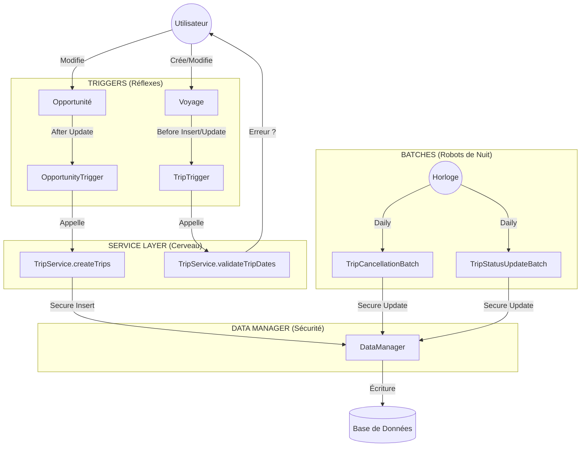

# Documentation Technique : Mécanique du Projet GlobalGroupTravel

Ce document décrit en détail les **interactions techniques** entre les différents composants du projet CRM. Il est destiné aux développeurs et administrateurs qui souhaitent comprendre la "mécanique" interne.

## 1. Vue d'Ensemble des Flux

Le projet s'articule autour de trois événements majeurs :
1.  **Réaction Immédiate** (Triggers) : Lors de la modification d'Opportunités ou de Voyages.
2.  **Traitement Différé** (Batches) : Maintenance quotidienne des données.
3.  **Sécurité** (DataManager) : Couche transverse obligatoire.

### Schéma de Fonctionnement

---

## 2. Détail des Mécanismes

### A. La Synchronisation Opportunité -> Voyage
Quand une affaire est gagnée, le système génère automatiquement le voyage associé.

*   **Déclencheur** : `OpportunityTrigger` (After Insert, After Update).
*   **Condition** : `StageName` passe à 'Closed Won'.
*   **Mécanisme** :
    1.  Le trigger détecte le changement d'état.
    2.  Il appelle `TripService.createTripsFromOpportunities`.
    3.  Le service instancie un objet `Trip__c`.
    4.  Il copie les champs (Nom, Dates, Destination...) de l'Opp vers le Trip.
    5.  Il insère le Trip via `DataManager.secureInsert`.

### B. Le Contrôle de Cohérence (Validation)
On empêche la saisie de données illogiques (ex: Fin avant Début).

*   **Déclencheur** : `TripTrigger` (Before Insert, Before Update).
*   **Mécanisme** :
    1.  Le trigger intercepte la transaction **avant** l'écriture en base.
    2.  Il appelle `TripService.validateTripDates`.
    3.  Si `End_Date__c <= Start_Date__c`, la méthode ajoute une erreur (`addError`).
    4.  Conséquence : La transaction entière est annulée. L'utilisateur voit le message d'erreur.

### C. L'Automatisation Nocturne (Jobs Planifiés)
Ces processus s'exécutent sans intervention humaine, généralement la nuit.

#### 1. Annulation Automatique (`TripCancellationBatch`)
*   **Fréquence** : Quotidienne.
*   **Cible** : Voyages commençant dans **exactement 7 jours** (`NEXT_N_DAYS:7`).
*   **Critère** : Moins de 10 participants.
*   **Action** : Passe le statut à 'Annulé'.

#### 2. Mise à Jour des Statuts (`TripStatusUpdateBatch`)
*   **Fréquence** : Quotidienne.
*   **Cible** : Tous les voyages non annulés.
*   **Logique Temporelle** :
    *   **A venir** : `Aujourd'hui < Date Début`
    *   **En cours** : `Date Début <= Aujourd'hui <= Date Fin`
    *   **Terminé** : `Aujourd'hui > Date Fin`
*   **Action** : Met à jour le champ `Status__c` si nécessaire.

---

## 3. Architecture de Sécurité (`DataManager`)

L'application respecte strictement le modèle de sécurité Salesforce (CRUD/FLS).
Plutôt que d'écrire `insert monVoyage;`, le code utilise toujours `DataManager.secureInsert(monVoyage);`.

**Pourquoi ?**
*   **Vérification CRUD** : "L'utilisateur a-t-il le droit de *Créer* un objet Voyage ?"
*   **Vérification FLS** : "A-t-il le droit d'écrire dans le champ *Montant* ?"
*   **StripInaccessible** : Si l'utilisateur essaie de forcer une valeur dans un champ interdit, cette valeur est retirée silencieusement avant l'écriture, évitant les failles de sécurité.

---

## 4. Modèle de Données (Rappel Technique)

*   **Objet** : `Trip__c`
*   **Relations** :
    *   Adhère à : `Account` (Master-Detail ou Lookup selon config, ici Lookup `Account__c`).
    *   Lié à : `Opportunity` (Lookup `Opportunity__c`).
