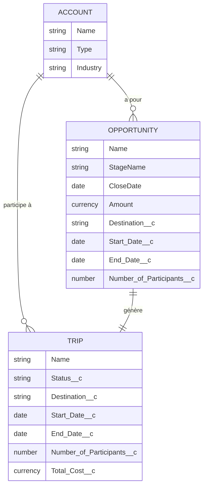

# Documentation du Projet CRM GlobalGroupTravel

## Introduction
Ce document présente l'architecture technique, le modèle de données et les fonctionnalités implémentées pour le CRM de GlobalGroupTravel sur Salesforce.

## 1. Schéma du Modèle de Données
Le schéma suivant illustre les relations entre les objets standards (Account, Opportunity) et l'objet personnalisé `Trip__c`.



## 2. Liste des Fonctionnalités

### GGT-01 : Structure des Données
**Description** : Création de l'objet `Trip__c` et des champs personnalisés sur `Opportunity` pour stocker les informations de voyage.
**Réalisé** : Oui. Objets et champs déployés.

### GGT-02 : Création Automatique de Voyage
**Description** : Lorsqu'une Opportunité passe à "Closed Won", un Voyage est automatiquement créé.
**Implémentation** : `TripService.createTripsFromOpportunities`
- Copie : Destination, Dates, Participants, Montant.
- Statut par défaut : "A venir".

### GGT-03 : Validation des Dates
**Description** : Empêcher la création d'un voyage si la Date de Fin est antérieure à la Date de Début.
**Implémentation** : `TripService.validateTripDates` trigger `before insert/update`.

### GGT-04 : Annulation Automatique
**Description** : Annuler les voyages commençant dans 7 jours avec moins de 10 participants.
**Implémentation** : `TripCancellationBatch` (Job planifié quotidiennement).

### GGT-05 : Mise à jour Automatique des Statuts
**Description** : Mettre à jour le statut (A venir / En cours / Terminé) selon la date du jour.
**Implémentation** : `TripStatusUpdateBatch` (Job planifié quotidiennement).

## 3. Détails du Code et Sécurité

### Gestion des Données Sécurisée (`DataManager`)
Toutes les opérations CRUD passent par cette classe qui vérifie les permissions de l'utilisateur (FLS/CRUD) avant d'agir.

```java
public static void secureInsert(List<SObject> records) {
    if (!type.getDescribe().isCreateable()) {
        throw new SecurityException('Insufficient permissions');
    }
    // ... insert ...
}
```

### Automatisation (`TripService`)
Logique métier centralisée pour faciliter la maintenance et les tests.

```java
public static void createTripsFromOpportunities(...) {
    if (opp.StageName == 'Closed Won') {
         Trip__c newTrip = new Trip__c();
         // ... mapping ...
         tripsToInsert.add(newTrip);
    }
    DataManager.secureInsert(tripsToInsert);
}
```

### Sécurité (Permission Sets)
- **Admin** : Accès total + Suppression.
- **Standard User** : Lecture/Ecriture sur les Voyages, mais **pas de suppression**.
